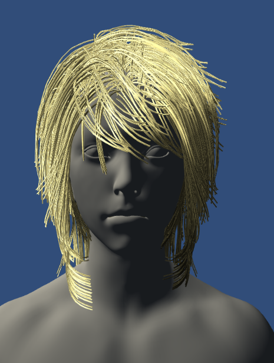
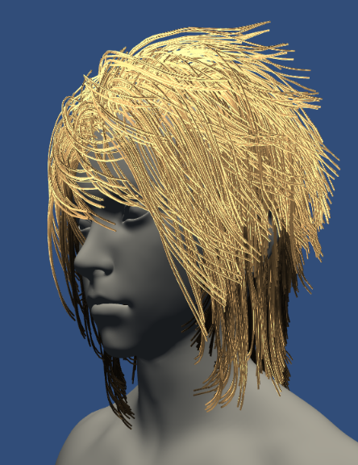
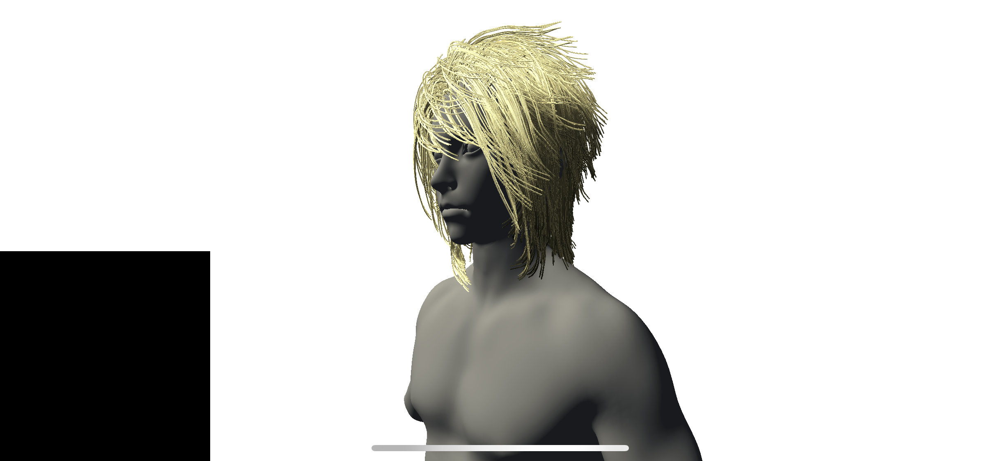

# DeepShadowMap

## On iPhone XS

There are only 30 FPS on iphone XS. Mostly because the complex geometry takes a lot of gpu time on culling.

# Reference

* GPU Pro4 IV 1. Real-Time Deep Shadow Maps
* https://github.com/ecidevilin/GPU-Pro-Books-Source-Code
* [Model](https://3dexport.com/free-3dmodel-girl-head-free-190960.htm)